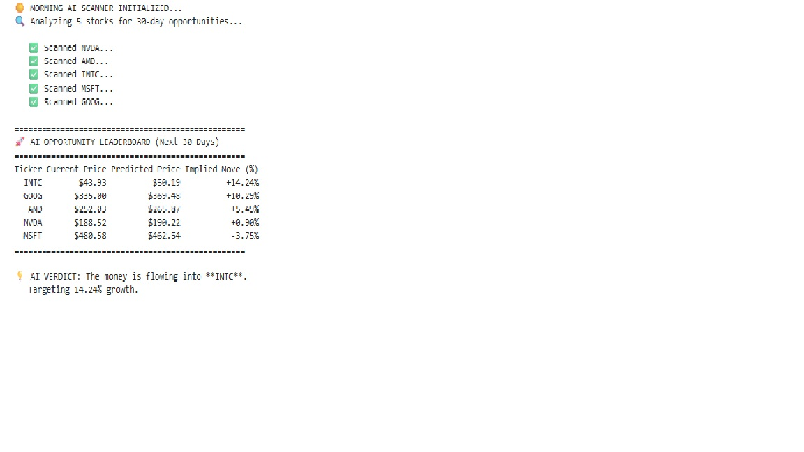
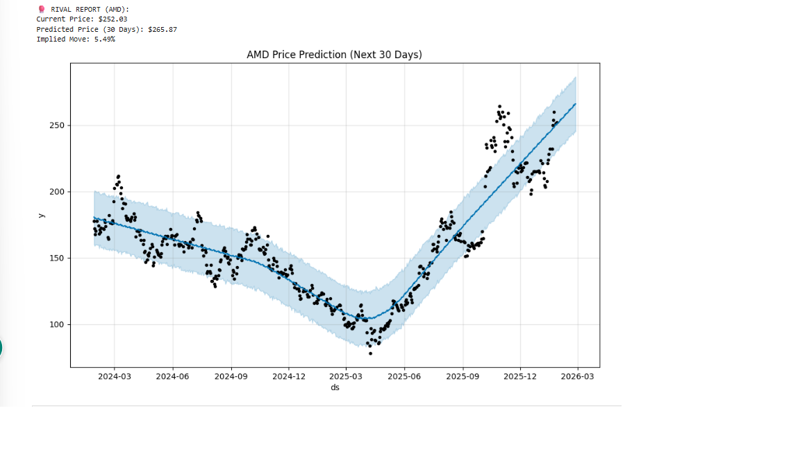

# AI-Powered Equity Research Analyst

## Project Overview
This project is an autonomous financial analysis agent designed to automate the workflow of a Hedge Fund Analyst. It combines **Fundamental Analysis** (using RAG to read 10-K filings) with **Quantitative Forecasting** (using Facebook Prophet for time-series modeling).

## Key Results (Live Algorithm Output)
The agent automatically scans semiconductor stocks for "Sector Rotation" opportunities.

### 1. The Opportunity Leaderboard
The algorithm identified a **+14.24% mean-reversion opportunity in Intel (INTC)**, contrasting it with a crowded/neutral signal in NVIDIA (+0.90%).

### 2. Machine Learning Forecast (AMD)
Using a Prophet time-series model, the agent projected a bullish recovery trend for AMD with a +5.49% implied move. The blue shaded area represents the 80% confidence interval.

## Technical Implementation
* **Vector Database (RAG):** Ingests 100+ page PDF reports, chunks them, and retrieves specific geopolitical risk factors using OpenAI Embeddings.
* **Time-Series Engine:** Trains Prophet models on 2 years of daily OHLCV data to predict 30-day price targets.
* **Risk Agent:** Uses GPT-4 Turbo to synthesize "Buy/Hold/Sell" memos based on the retrieved data.

## How to Run
1.  Clone the repository.
2.  Install dependencies: `pip install langchain openai prophet yfinance`
3.  Add your API Key.
4.  Run the Jupyter Notebook.

---
*Disclaimer: This project is for educational purposes only and does not constitute financial advice.*
